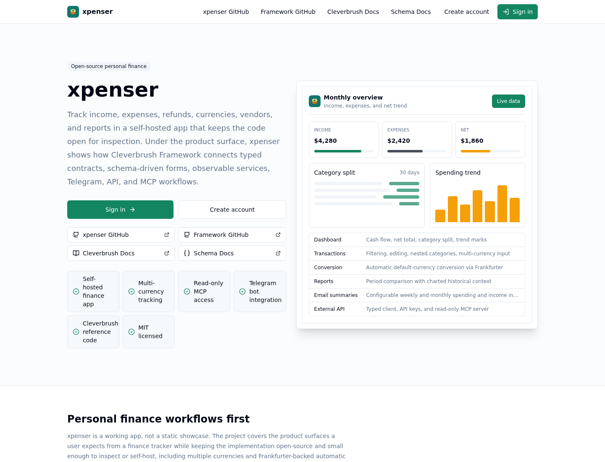

# xpenser

Open-source personal income and expense tracking for people who want a
self-hosted finance app they can inspect, extend, and connect to their own
workflows.



xpenser is also a real-world reference app for
[Cleverbrush Framework](https://docs.cleverbrush.com). It shows how a
schema-first TypeScript stack can drive API contracts, validation, OpenAPI,
typed clients, React forms, auth-aware endpoints, observability, Telegram
workflows, and MCP access from one cohesive application.

## Why xpenser

- Track income, expenses, refunds, and returns with categories, notes, dates,
  vendors, and currencies.
- Review daily, weekly, monthly, quarterly, and yearly summaries with category
  split and trend context.
- Use multiple transaction currencies with automatic conversion to your default
  currency through [Frankfurter](https://www.frankfurter.app/).
- Capture transaction scans, enrich vendor data, and keep setup workflows usable
  on mobile and desktop.
- Receive optional weekly and monthly email summaries with OpenAI-generated
  spending and income insights.
- Connect external tools through API keys, a typed Node client, a read-only MCP
  server, and a Telegram bot.

## Built With Cleverbrush

xpenser is intentionally small enough to inspect while still exercising
production-shaped framework patterns:

- `packages/contracts` defines the public contract with Cleverbrush schemas.
- `apps/api` exposes the contract through Cleverbrush server handlers,
  auth metadata, OpenAPI, DI, logging, tracing, and MCP.
- `packages/client` wraps the generated Cleverbrush client with retry, timeout,
  dedupe, batching, cache tags, and OpenTelemetry propagation.
- `packages/ui` binds Cleverbrush schema fields to reusable React form
  controls.

Start with [Cleverbrush Reference Notes](./docs/cleverbrush-reference.md) if
you are here to learn the framework patterns behind the app. For upstream
framework docs, use:

- [Cleverbrush Framework source](https://github.com/cleverbrush/framework)
- [Cleverbrush Framework docs](https://docs.cleverbrush.com)
- [Cleverbrush Schema docs](https://schema.cleverbrush.com)

## Quick Start

### Prerequisites

- Node.js 22
- npm 11
- Docker with Docker Compose v2 (`docker compose`)

### 1. Install dependencies

```sh
npm install
```

### 2. Create a local environment file

```sh
cp .env.example .env
```

The defaults in `.env.example` are safe for local development and point the app
at PostgreSQL on `localhost:5432`.

### 3. Build shared workspaces

The apps import local packages from their built `dist` outputs, so build the
shared packages once before starting dev servers:

```sh
npm run build -w @xpenser/contracts
npm run build -w @xpenser/client
npm run build -w @xpenser/ui
```

### 4. Start PostgreSQL

```sh
docker compose up -d postgres
```

Useful checks:

```sh
docker compose ps postgres
docker compose logs postgres
```

### 5. Start the app

```sh
npm run dev
```

The API runs database migrations on startup.

Local URLs:

- Web app: http://localhost:3000
- API: http://localhost:4000
- API health check: http://localhost:4000/health
- OpenAPI JSON: http://localhost:4000/openapi.json

## Authentication

Email/password sign-in works without any external auth provider. Accounts
created this way must confirm their email before signing in.

Google sign-in supports two modes:

- Direct Google OAuth for self-hosted deployments.
- Cleverbrush Passport for the hosted Cleverbrush deployment.

Select the mode with `GOOGLE_SIGN_IN_MODE`:

```env
GOOGLE_SIGN_IN_MODE=auto
```

`auto` uses direct Google OAuth when `AUTH_GOOGLE_ID` and
`AUTH_GOOGLE_SECRET` are configured. If those are not set, it uses Passport only
when all Passport variables are configured. If neither auth provider is
configured, the Google sign-in button is hidden and email/password sign-in still
works.

Use `GOOGLE_SIGN_IN_MODE=direct` to require direct Google OAuth,
`GOOGLE_SIGN_IN_MODE=passport` to require Passport, or
`GOOGLE_SIGN_IN_MODE=disabled` to hide Google sign-in even when credentials are
present.

### Direct Google OAuth

Create an OAuth 2.0 client in Google Cloud Console:

- Application type: Web application
- Authorized JavaScript origin: your public `APP_URL`
- Authorized redirect URI: `${APP_URL}/api/auth/callback/google`

For local development with the default `APP_URL`, use:

```text
http://localhost:3000/api/auth/callback/google
```

Configure the web app with Auth.js-standard Google variables:

```env
APP_URL=https://xpenser.example.com
NEXTAUTH_URL=https://xpenser.example.com
NEXTAUTH_SECRET=replace-with-at-least-32-characters
AUTH_SECRET=replace-with-the-same-value-as-NEXTAUTH_SECRET
GOOGLE_SIGN_IN_MODE=auto
AUTH_GOOGLE_ID=your-google-oauth-client-id
AUTH_GOOGLE_SECRET=your-google-oauth-client-secret
```

Google accounts must have a verified email address. If a local email/password
account already exists with the same email, Google sign-in is rejected instead
of silently linking the accounts.

### Cleverbrush Passport

Passport is a private Cleverbrush auth broker. Self-hosted deployments should
use direct Google OAuth unless they run their own compatible Passport service.

Configure both services with:

```env
GOOGLE_SIGN_IN_MODE=passport
PASSPORT_BASE_URL=https://auth.cleverbrush.com
PASSPORT_PROJECT=xpenser
PASSPORT_ENVIRONMENT=production
PASSPORT_PUBLIC_KEY=
```

`PASSPORT_PUBLIC_KEY` is optional. When empty, the API fetches
`<PASSPORT_BASE_URL>/.well-known/public-key` and caches it in memory. If set,
use the base64-encoded PEM public key.

## Full Docker Run

For a production-like local run, build and start the full Compose stack:

```sh
docker compose up --build
```

This starts the containerized web app, API, PostgreSQL, Swagger UI, and
observability services defined in `docker-compose.yml`.

Full Docker URLs:

- Web app: http://localhost:3000
- External API proxy: http://localhost:3000/external-api
- Swagger UI: http://localhost:8090
- SigNoz: http://localhost:8080

For public deployments, put your reverse proxy in front of the web app and set
`APP_URL` to the public origin. The API service stays private on the Docker
network and the Next app exposes it under `/external-api`.

## External API

Create an API key from Settings -> Preferences -> API keys. The API key can be
used as a bearer token with curl or with the typed Node client:

```sh
curl -X POST "$APP_URL/external-api/transactions" \
  -H "Authorization: Bearer $XPENSER_API_KEY" \
  -H "Content-Type: application/json" \
  -d '{"categoryId":1,"amount":12.34,"currency":"USD","effect":"normal","occurredAt":"2026-05-13T12:00:00.000Z"}'
```

```ts
import { createXpenserClient } from '@xpenser/client';

const client = createXpenserClient({
    baseUrl:
        process.env.XPENSER_API_BASE_URL ??
        'http://localhost:3000/external-api',
    getToken: () => process.env.XPENSER_API_KEY ?? null
});

await client.transactions.create({
    body: {
        categoryId: 1,
        amount: 12.34,
        currency: 'USD',
        effect: 'normal',
        occurredAt: new Date()
    }
});
```

Omit `effect` or set it to `normal` for regular transactions. Use
`effect: 'reversal'` for refunds in expense categories or payments and
chargebacks in income categories; the entered amount stays positive and reports
subtract it from that category.

`X-API-Key: $XPENSER_API_KEY` is also accepted.

## MCP Server

xpenser exposes a read-only MCP Streamable HTTP endpoint for AI agents at
`/external-api/mcp`. Use the same API key from Settings -> Preferences -> API
keys as a bearer token:

```json
{
  "mcpServers": {
    "xpenser": {
      "type": "streamable-http",
      "url": "https://xpenser.example.com/external-api/mcp",
      "headers": {
        "Authorization": "Bearer ${XPENSER_API_KEY}"
      }
    }
  }
}
```

The MCP server exposes read-only tools for the current user, categories,
transactions, dashboard summaries, and statistics. Transaction write operations
are not exposed through MCP.

## Development Commands

```sh
npm run lint
npm run typecheck
npm test
npm run test:e2e
```

Database helpers:

```sh
npm run db:run -w @xpenser/api
docker compose stop postgres
docker compose down
docker compose down -v
```

The e2e suite requires `PLAYWRIGHT_BASE_URL` when run outside the GitHub PR
environment.

## Contributing

Contributions are welcome. Good first areas include documentation, self-hosting
guides, framework reference notes, UI polish, API examples, and small focused
product improvements.

- Read [CONTRIBUTING.md](./CONTRIBUTING.md) before opening a PR.
- Use issues for actionable bugs and feature requests.
- Use GitHub Discussions for questions, ideas, and Cleverbrush learning threads.
- Keep Cleverbrush contract, endpoint metadata, and handler trees aligned when
  changing the API.

## Project Status

xpenser is early, practical, and evolving. The goal is to remain useful as a
personal finance app while staying clear enough for developers to learn how a
Cleverbrush full-stack project fits together.

## License

xpenser is released under the [MIT License](./LICENSE).
